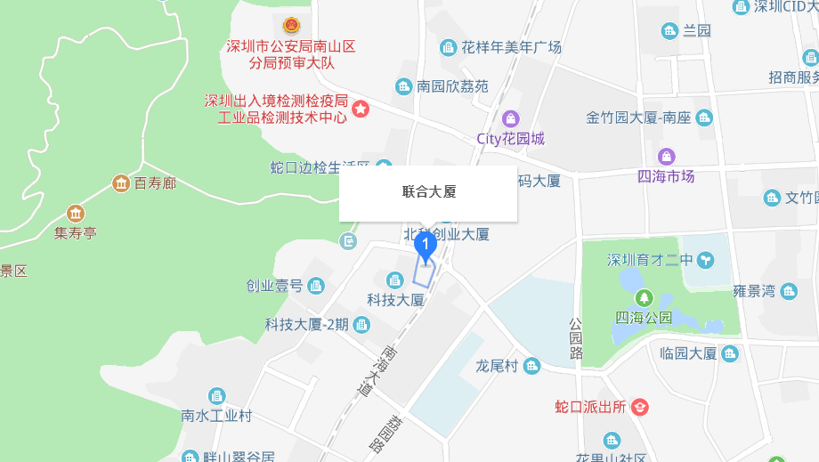

# XRADIOTECH文档中心

[[English]](index-en.md)

## 芯之联简介
深圳芯之联科技有限公司 (Xradio Technology) 成立于2015年，是一家专业从事物联网芯片的研发、设计、销售于一体的高新技术企业，主要产品包括无线连接、无线MCU、无线音频、智能语音等芯片。公司秉承“自主创新，技术领先”的理念，以市场和研发创新为主导，在低功耗低成本CMOS无线射频技术领域深耕钻研，产品广泛应用于平板、OTT盒子、无人机、物联网、智能家居、智能音频、儿童机器人等众多领域。

* 2012.04 - 组建完整的研发团队
* 2015.07 - 公司在深圳注册成立
* 2015.09 - 发布第一颗WiFi连接芯片XR819
* 2017.06 - 发布第一颗超低功耗无线应用MCU XR871
* 2017.12 - 发布第一颗WiFi/BT二合一射频芯片XR829
* 2018.01 - 发布第一颗高性能32位应用微处理器XR32F4
* 2018.05 - 发布第一颗物联网WiFi控制芯片XR809
* 2018.04 - 发布低功耗极致IoT WiFi MCU XR808
* 2018.10 - 发布高性能智能WiFi MCU XR872

## 文档中心说明
此处是芯之联科技公司及产品文档中心，此处展示深圳芯之联科技有限公司的基本信息，产品手册，硬件参考及开发指南等相关信息，用以帮助和指导希望了解芯之联产品并用之开发相关应用的客户，开发者，学生及发烧友等群体人员。

## 文档导航

||||
|:---:|:---:|:--:|
||||
|[快速入门](zh_CN/get-started.md)|[产品手册](zh_CN/api-ref.md)|[硬件参考](zh_CN/hw-ref.md)|
||||
|[软件指南](zh_CN/sw-guide.md)|[API参考](zh_CN/api-ref.md)|[产品设计](zh_CN/product-design.md)|
||||
|[生产测试](zh_CN/mp-test.md)|[认证指导](zh_CN/cert.md)|[生产测试](zh_CN/reports.md)|

## 联系我们

电话: (086)-0755-33018031  
邮箱: service@xradiotech.com  
地址: 深圳市南山区蛇口南海大道1069号联合大厦13楼  

<html>
    <body>
        
    </body>
</html>

