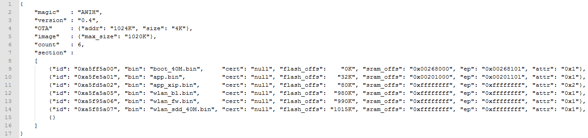

[[English]](index-en.md)

<style>
table { width: 100%; }
table th {
    font-weight: bold; /*加粗*/
    text-align: left !important; /*内容居中，加上 !important 避免被 Markdown 样式覆盖*/
    background: rgba(66,66,66,0.5); /*背景色*/
    color: white;
}
table tbody tr:nth-child(2n) {
    background: rgba(66,66,66,0.05); 
}
table th {
    white-space: nowrap; /*表头内容强制在一行显示*/
}
</style>

# 概述

此文档旨在指导芯之联无线MCU产品开发者从零开始搭建开发所必须的软硬件开发环境，为开发工作做好准备，并指导其在某一指定平台完成SDK下载，工具安装，工程创建，编译，打包，烧录等一系列流程步骤。

| 注意|
|:---- |
|该文档中提到的一系列步骤具有普适性，适用于XR808，XR872等各无线MCU SDK平台，示例为了方便选取其一，其他平台需要根据其硬件及软件定义灵活处理|

# 准备工作
* 硬件
    * 一块开发板
    * 一根USB转UART线 (建议采用CH340芯片平台)
    * PC (Windows，Linux或MacOS)

* 软件
    * 工具链及编译工具(gcc, make等)
    * git工具
    * 代码编辑器(VSCode，Ultraedit，Vim等)

连接示意图如下：  


# 了解硬件
请点击下方链接，了解有关具体开发板的详细信息。

* [XR872_EVB_IO](xr872_evb_io.md)
* [XR872_EVB_AI](xr872_evb_AI.md)
* [XR808_EVB_IO](xr808_evb_io.md)

# 搭建环境
## Linux平台搭建
以Ubuntu为代表系统说明如下：

##### 1. 打开终端窗口，安装开发相关工具，在终端窗口输入以下命令

```bash
sudo apt-get install cmake git python python-pip vim wget
```

##### 2. 创建工作目录并下载SDK

```bash
mkdir xradiotech
cd xradiotech
git clone https://github.com/XradioTech/xradio-skylark-sdk.git
```
此时芯之联无线MCU SDK将会下载到xradiotech的目录下，仓库名为xradio-skylark-sdk

##### 3. 创建工具目录，并下载gcc工具

```bash
cd xradiotech  
mkdir tools  
cd tools  
wget https://launchpad.net/gcc-arm-embedded/4.9/4.9-2015-q2-update/+download/gcc-arm-none-eabi-4_9-2015q2-20150609-linux.tar.bz2  
tar -xf gcc-arm-none-eabi-4_9-2015q2-20150609-linux.tar.bz2
```

## Windows平台搭建
##### 1. 安装Cygwin工具

* 从Cygwin官方网站下载Cygwin终端setup-x86.exe
*  运行setup-x86.exe安装Cygwin工具包（**注意：安装路径不要包含中文路径或者空格**）
* 在安装包选项选择想要安装的工具包（**cmake, git, wget, binutils， python, python-pip， zip, unzip, vim**等）

##### 2. 运行Cygwin Terminal进入到终端程序，进入到工程目录（自己选择），创建工程目录，并下载SDK

```bash
mkdir xradiotech
cd xradiotech
git clone https://github.com/XradioTech/xradio-skylark-sdk.git
```

此时芯之联无线MCU SDK将会下载到xradiotech的目录下，仓库名为xradio-skylark-sdk

##### 3. 创建工具目录，并下载gcc工具

```bash
cd xradiotech
mkdir tools
cd tools
wget https://launchpad.net/gcc-arm-embedded/4.9/4.9-2015-q2-update/+download/gcc-arm-none-eabi-4_9-2015q2-20150609-win32.zip
unzip -o gcc-arm-none-eabi-4_9-2015q2-20150609-win32.zip
```

| 注意|
|----|
|如果wget和unzip命令执行失败，请点击上面的链接直接通过浏览器下载到tools目录使用相关的工具解压|

## 编译示例工程
##### 1. 配置gcc路径
修改 `xradio-skylark-sdk/gcc.mk` 中的“CC_DIR”变量，将路径指向解压缩的 
`gcc-arm-none-eabi-xxxxx/bin`目录：

```bash
CC_DIR = ~/tools/gcc-arm-none-eabi-4_9-2015q2/bin
```

##### 2. 选择工程 `project/demo/wlan_demo` , 进入gcc目录，配置工程型号及时钟类型

```
make config
```

配置界面示例如下：  


##### 3. 编译系统模块生成模块 .a 文件， 并生成可执行文件

```
make lib -j4
make
```

正确编译完成后，结果显示如下：  


##### 4. 打包固件，生成镜像文件

```
make image
```

正确打包完成后，结果显示如下：  


附：

|命令&emsp;&emsp;&emsp;&emsp;&emsp;&emsp;&emsp;&emsp;|行为|
| ---- | ---- |
|make config | 配置工程平台芯片型号及板级晶振选型，目前主要包括XR872和XR808平台，配置完成后将在xradio-skylark-sdk目录下生成.config文件<br>*注:在编译之前必须执行，否则无法编译* |
|make config_clean | 清除.config文件 |
|make lib | 编译功能模块，生成.a文件并拷贝到lib目录下 |
|make lib_clean | 清理已编译的lib目标文件，及模块的.o文件，但并不会删除lib下的.a文件|
|make lib_install_clean | 清理lib下的.a文件 |
|make | 编译工程代码，生成可执行文件（位于“project/[prj]/gcc/”目录）|
|make clean | 清除make命令生成的目标文件 |
|make image | 创建镜像文件（位于“project/image/xxx/”目录）|
|make build | 等同于make lib && make && make image |
|make build_clean | 等同于make image_clean clean lib_clean lib_install_clean |
|make objdump | 生成反汇编文件，用于代码分析和调试 |
|make size | 显示工程ELF文件的size信息，如text段、data段、bss段大小等 |

## 烧录固件
##### 1. 烧录工具
烧录固件使用`xradio-skylark-sdk/tools/PhoenixMC.exe`工具，界面如下


* 串口设置 - 点击“刷新”按钮可以显示COM口列表，勾选选择COM口，下拉选择波特率，默认115200
* 选择固件 - 点击按钮选择应用程序固件文件，默认为xr_system.img文件
* 升级固件 - 当设备连接并接入升级模式，选择完固件并设置好COM口后，点击“升级固件”按钮开始升级
* 镜像信息 - 显示镜像的打包信息，具体含义可参考打包配置文件说明
* 进度条   - 刷机过程中可显示刷机进度，当完成100%时完成刷机
* 设置 - 设置刷机默认条件
* 调试 - 调试工具，可以在升级模式下读写flash，读写寄存器状态等信息

##### 2. 设置界面


* 烧写ETF | 合并镜像 - 将xr_system.img和etf.img合并成一个固件，同时烧写进去。*注：etf固件为RF测试固件*
* 写入后进行校验 - 烧录通过读出内容校验写入的正确性，不勾选时仅靠通信协议保障正确性。*注：会影响烧录速度*
* 兼容flash模式 - 默认勾选，兼容XR871，XR809平台模式
* 只更新修改的文件 - 烧录前确认数据是否修改，如无修改则调过此段，用以节省时间
* 小端通信 - 传输协议采用小端数据格式
* 擦除自定义区域 - 烧录完成后擦除指定的flash区域，需小心使用

##### 3. 烧录

  1. 进入升级模式
  2. 选择固件和串口，点击升级
  3. 等待完成

附：进入升级模式的方法

|场景&emsp;&emsp;&emsp;&emsp;&emsp;&emsp;&emsp;|进入升级模式方法|适用平台|
| ---- | ---- | ---- |
|裸片(flash为空片)|上电后将自动进入升级模式|所有平台|
|正在运行的系统|方法1：控制台输入“upgrade”+回车，系统会重启并进入升级模式<br>方法2：断开控制台，设置好PhoenixMC，直接选择“升级固件”，工具会发送方法1中的命令使设备进入升级模式|所有平台|
|任何场景强制升级|步骤：<br>1. 拉低CHIP-PWD复位芯片<br>2. 拉低PB2,PB3到低电平<br>3. 松开CHIP-PWD使芯片运行，然后释放PB2,PB3<br>此时芯片强制进入升级模式|所有平台|

##### 4. Linux平台烧录
烧录固件使用`xradio-skylark-sdk/tools/phoenixMC`命令行工具进行烧写，工具配置见setting.ini文件

## 调试使用
*注：XRADIOTECH的MCU平台仅支持串口打印信息辅助调试，暂不支持Keil，IAR等IDE集成开发环境*

启动后打印信息查看系统运行状况，并通过控制台命令来辅助才做相关行为，控制台命令请参考[<控制台命令集成与命令集参考>]()

## 目录结构及工程配置
##### 1. SDK目录结构

```
.
├── bin                        	# bin文件目录，存放预置bin文件
├── chip.mk
├── config.mk
├── gcc.mk
├── include                   	# 头文件目录，存放模块对外头文件
├── lib                        	# 库文件目录，存放预置库文件和编译生成的库文件
│   ├── libaac.a
│   ├── libadt.a
│   └── ......
├── project                    	# 工程总目录
│   ├── bootloader           	# bootloader工程
│   ├── common                	# 工程公用代码
│   ├── demo                  	# 演示工程总目录，该目录下每个目录对应一个工程
│   │   ├── hello_demo
│   │   ├── wlan_demo
│   │   └── ......
│   ├── example               	# 示例工程总目录，该目录下每个目录对应一个工程
│   │   ├── uart
│   │   ├── wlan
│   │   └── ......
│   ├── image_cfg
│   │   └── image.cfg         	# 默认镜像配置文件
│   ├── linker_script
│   │   └── gcc
│   │       ├── appos.ld      	# 工程默认链接脚本
│   │       └── bootloader.ld	# bootloader链接脚本
│   ├── project.mk
│   └── ......
├── src
│   ├── driver
│   │   ├── chip              	# 芯片外设驱动
│   │   └── component         	# 扩展外设驱动
│   ├── image                 	# image模块
│   ├── kernel                	# 内核
│   ├── ota                  	# OTA模块
│   └── ......
├── ......
└── tools                     	# 镜像打包及烧录等工具
```

##### 2. Makefile和配置文件
XRADIO SDK的代码编译和镜像创建采用Makefile进行管理，关键Makefile和配置文件的说明见表2-1。除特殊说明外，下文所有路径描述均为相对于SDK根目录的相对路径。

|文件路径|功能描述及相关说明|
| ---- | ---- |
|gcc.mk| 1. 定义通用编译规则，例如交叉编译工具链、编译选项、链接选项等<br>2. 用户只需要修改交叉编译工具链的路径定义“CC_DIR”|
|config.mk| 1. 定义全局配置选项。所有全局配置选项均有默认值，其作用范围是SDK所有代码<br>2. 一般情况下，用户不需要修改此文件。如果用户需要改变全局配置选项的值，可在“project/[prj]/gcc/localconfig.mk”中进行重定义，从而覆盖默认值|
|chip.mk|定义芯片配置选项，不允许用户修改|
|src/Makefile|定义SDK模块，每个模块编译后均生成对应的库文件|
|src/lib.mk|定义模块通用编译规则|
|src/[module]/Makefile|模块编译的Makefile，用于指定模块的库文件名、源文件等|
|project/project.mk|定义工程的通用编译规则，一般无需修改|
|project/[prj]/gcc/localconfig.mk|定义特定工程的本地配置选项。在此文件中定义的配置选项将会覆盖“config.mk”中定义的默认值|
|project/[prj]/gcc/Makefile|特定工程的Makefile，用于指定工程板级配置、源文件、链接脚本、镜像配置文件等|
|project/common/prj_conf_opt.h|1. 定义工程功能选项的默认配置（即针对所有工程的默认配置）。每个功能选项对应一个宏定义，例如中断服务程序栈大小（PRJCONF_MSP_STACK_SIZE）、主线程栈大小（PRJCONF_MAIN_THREAD_STACK_SIZE）等<br>2. 该文件中定义的宏，“project/”目录下的所有源文件均可见<br>3. 一般情况下，用户不需要修改此文件。如果特定工程需要改变某功能选项的值，可在“project/[prj]/prj_config.h”中进行重定义，从而覆盖默认值|
|project/[prj]/prj_config.h|1. 定义特定工程的功能选项配置值。在此文件中定义的功能选项值将会覆盖“project/common/prj_conf_opt.h”中定义的默认值<br>2. 每个工程都必须实现本工程的“prj_config.h”文件<br>3. 该文件中定义的宏，“project/”目录下的所有源文件均可见|

*注：一般情况下，用户只需要修改以下文件来实现工程配置定义：*
* project/[prj]/gcc/Makefile
* project/[prj]/gcc/localconfig.mk（覆盖“config.mk”中的默认配置）
* project/[prj]/prj_config.h（覆盖“project/common/prj_conf_opt.h”中的默认配置）

##### 3. 工程配置选项

在配置文件`config.mk`文件定义的所有全局配置选项，均可通过修改工程中的`project/[prj]/gcc/localconfig.mk`进行重定义，该定义将会覆盖`config.mk`中的默认值在编译过程中生效。
例如，`config.mk`默认开启了XIP功能，定义如下：

```
__CONFIG_XIP ?= y
```

如果某工程要禁用XIP功能，则需在`project/[prj]/gcc/localconfig.mk`文件中增加以下定义：

```
export __CONFIG_XIP := n
```

| 注意|
|:---- |
|修改“project/[prj]/gcc/localconfig.mk”文件后，必须先执行“make build_clean”清除中间文件后，才可执行“make build”进行代码编译和镜像创建,否则可能出现配置错误或冲突|

常见配置说明见下表：

|配置|配置说明|
| --- | --- |
|__CONFIG_XIP	|是否启用XIP功能|
|__CONFIG_PSRAM	|是否启用PSRAM（仅XR872AT支持PSRAM）|
|__CONFIG_WLAN_STA	|是否支持Wi-Fi station（不支持WPS）模式|
|__CONFIG_WLAN_STA_WPS	|是否支持Wi-Fi station（支持WPS）模式|
|__CONFIG_WLAN_AP	|是否支持Wi-Fi softAP模式|
|__CONFIG_WLAN_MONITOR	|是否支持Wi-Fi monitor模式|
|__CONFIG_OTA	|是否支持OTA功能|
|__CONFIG_XPLAYER	|是否支持音频播控功能|
|__CONFIG_SECURE_BOOT	|是否启用安全启动功能|
|__CONFIG_CACHE_POLICY	|Cache大小配置|
|__CONFIG_MALLOC_TRACE	|是否开启堆调试功能，该功能仅用于堆问题的调试，如内存泄漏等；开启该功能后，会多消耗约8KB内存|

##### 4. 工程Makefile
工程Makefile位于`project/[prj]/gcc/Makefile`，主要用于指定工程的板级配置、源文件、链接脚本、镜像配置文件等，关键变量的定义说明如表所示:

|配置|配置说明|
| --- | --- |
|ROOT_PATH|SDK根目录路径，该路径是相对于工程Makefile的路径，例如“project/demo/hello_demo/gcc/Makefile”中定义的ROOT_PATH为“../../../..”|
|PROJECT|工程名字，默认定义为跟工程目录名字一致（一般无需修改），即：<br>PROJECT := $(notdir $(shell cd .. && pwd))|
|PRJ_ROOT_PATH|工程根目录，使用变量“ROOT_PATH”进行定义|
|PRJ_BOARD|1. 板级配置目录路径，该目录下必须包含“board_config.c”和“board_config.h”两个文件<br>2. 在“project/common/board/”目录下存放了若干XRADIO开发板的板级配置文件，可参考这些文件完成特定工程板级配置文件的创建<br>3. 由于不同方案的板级配置（主要是pinmux配置）一般都会存在差异，所以，新建的工程必须新建对应的板级配置，否则板级配置错误可能导致系统启动异常|
|PRJ_EXTRA_LIBS_PATH|定义额外的库文件搜索路径。默认库文件搜索路径为“lib/”，通常用于将第三方库直接放入工程目录中索引文件|
|PRJ_EXTRA_LIBS|定义额外的库文件<br>如果工程需要使用SDK以外的库文件，可通过“PRJ_EXTRA_LIBS_PATH”和“PRJ_EXTRA_LIBS”变量来指定。例如，需要链接工程根目录下的“\$(PRJ_ROOT_PATH)/foo/libbar.a”，则增加定义如下: <br>PRJ_EXTRA_LIBS_PATH := -L$(PRJ_ROOT_PATH)/foo<br>PRJ_EXTRA_LIBS := -lbar|
|PRJ_EXTRA_INC_PATH|定义额外的头文件搜索路径。例如，需要指定工程根目录下的“foo”目录为头文件搜索路径，则增加定义如下<br>PRJ_EXTRA_INC_PATH := -I$(PRJ_ROOT_PATH)/foo|
|PRJ_EXTRA_SYMBOLS|定义额外的宏，仅工程代码可见，一般不使用|
|LINKER_SCRIPT|1. 工程默认链接脚本为“project/linker_script/gcc/appos.ld”，特定工程可重定义“LINKER_SCRIPT”变量来指定该工程使用的链接脚本<br>2. “LINKER_SCRIPT”的路径定义是相对路径（相对于“$(PRJ_ROOT_PATH)/gcc/”）<br>3. 例如，工程需要使用“project/[prj]/gcc/appos.ld”链接脚本，则增加定义如下：<br>LINKER_SCRIPT := ./appos.ld<br>4. 编译过程中，会根据默认链接脚本或者工程指定的链接脚本，生成最终使用的链接脚本“project/[prj]/gcc/.project.ld”<br>5. 链接产生的ELF文件、bin文件、map文件等位于“project/[prj]/gcc/”目录下|
|IMAGE_CFG|1. 工程默认镜像配置文件为“project/image_cfg/image.cfg”，特定工程可重定义“IMAGE_CFG”变量来指定该工程使用的镜像配置文件<br>2. “IMAGE_CFG”的路径定义是相对路径（相对于“\$(PRJ_ROOT_PATH)/image/[chip]/”）<br>3. 例如，工程需要使用“project/[prj]/image/xr872/image.cfg”镜像配置文件，则增加定义如下：<br>IMAGE_CFG := ./image.cfg<br>4. 镜像创建过程中，会根据默认镜像配置文件或者工程指定的镜像配置文件，生成最终使用的镜像配置文件“project/[prj]/image/[chip]/.image.cfg”<br>5. 创建的镜像文件位于“project/[prj]/image/[chip]/”目录下|
|IMAGE_NAME|重定义生成的镜像文件名称，默认为xr_system.img|


##### 5. 链接脚本
链接脚本（扩展名为“.ld”）主要用于描述如何将输入文件（目标文件、库文件）中的段（text、data、bss等）映射到输出文件（ELF文件）中，并控制输出文件的存储布局，输出文件的存储布局采用输出段（链接脚本中以“SECTIONS”标记）进行描述。
工程的默认链接脚本为`project/linker_script/gcc/appos.ld`，特定工程可通过重定义`project/[prj]/gcc/Makefile`中的`LINKER_SCRIPT`变量来指定该工程使用的链接脚本。表3-2中有关于“LINKER_SCRIPT”变量的详细说明。
工程默认链接脚本关键的输出段说明如表所示：

|输出段|	说明|
| ---- | ---- |
|.xip | 1. XIP段（可读、可执行），位于FlASH空间中<br>2. 用于存储可执行代码和只读数据。在中断服务程序中执行的代码和访问的数据不能置于该输出段|
|.psram_text	| 1. PSRAM text段（可读、可执行），位于PSRAM空间中（仅XR872AT支持）<br>2. 用于存储可执行代码和只读数据|
|.psram_data| 1. PSRAM data段（可读、可写），位于PSRAM空间中（仅XR872AT支持）<br>2. 用于存储初始值非零的全局变量、静态变量等，一般是输入文件的data段|
|.psram_bss| 1. PSRAM bss段（可读、可写），位于PSRAM空间中（仅XR872AT支持）<br>2. 用于存储初始值为零的全局变量、静态变量等，一般是输入文件的bss段|
|.text| 1. SRAM text段（可读、可执行），位于SRAM空间中<br>2. 用于存储可执行代码和只读数据|
|.data| 1. SRAM data段（可读、可写），位于SRAM空间中<br>2. 用于存储初始值非零的全局变量、静态变量等，一般是输入文件的data段|
|.bss| 1. SRAM bss段（可读、可写），位于SRAM空间中<br>2. 用于存储初始值为零的全局变量、静态变量等，一般是输入文件的bss段|

链接脚本中.xip输出段的描述举例

```
SECTIONS
{
    .xip : 
    {
        *libaac.a: (.text .text.* .rodata .rodata.*)
        *libchip.a:hal_rtc.o (.text .text.* .rodata .rodata.*)
        *(.xip_text* .xip_rodata*)
    } > FLASH
}
```

上文中的脚本代码进行了以下设置：
* 将libacc.a库文件的text段和rodata段置于.xip输出段
* 将hal_rtc.o目标文件（位于libchip.a库文件中）的text段和rodata段置于.xip输出段
* 将代码中标记为.xip_text或者.xip_rodata属性的段置于.xip输出段

通过在输出段中添加输入文件的描述，可以将（目标文件、库文件）中的段（text、data、bss等）映射到输出段中。所有输出段均遵循相同的语法描述。链接脚本详细的语法可以参考工程默认链接脚本或者GUN ld文件的语法说明文档。

在进行链接脚本修改时，有以下注意事项：
  1. 在中断服务程序中执行的代码和访问的数据不能置于FLASH的.xip输出段。
  2. 不同存储区域的访问速度存在差异，实际方案可根据算力需求进行存储布局的调整。例如：将执行不频繁、对速度要求不高的代码放在.xip输出段；将执行频繁且对速度要求高的代码（例如某些算法）放在SRAM的.text输出段。存储区域的访问速度由高到低为：SRAM、PSARM（仅XR872AT支持）、Flash。
  3. 链接器按链接脚本中输出段的描述顺序，将输入文件的段置于指定输出段中；没有指定到XIP和PSRAM相关输出段的内容最后会默认置于SRAM相关输出段中。

##### 6. 镜像配置文件
镜像配置文件（扩展名为“.cfg”）采用JSON格式书写，主要用于描述如何将工程编译生成的二进制文件（app.bin、app_xip.bin等）和预置的二进制文件（wlan_bl.bin、wlan_fw.bin等）打包成镜像文件（扩展名为“.img”）。

工程的默认镜像配置文件为“project/image_cfg/image.cfg”，特定工程可通过重定义“project/[prj]/gcc/Makefile”中的“IMAGE_CFG”变量来指定该工程使用的镜像配置文件。

配置文件图示如下：



镜像文件由“tools/mkimage”工具生成。通过烧录工具“tools/phoenixMC.exe”可将镜像文件烧录到开发板的FLASH中运行。

|字段	|子段|说明|
| ---- | ---- | ---- |
|magic	|-| 区段（section）文件魔数，位于区段头部的标识，固定为AWIH|
|version |-| 版本号|
|OTA	|-| 用于指定OTA参数区域在FLASH中的其实地址和大小|
|image	|-| 用于指定当前镜像大小的最大值|
|count	|-| 指定“section”字段中的文件数目|
|section	|-| 区段文件列表|
|  |id	|区段的标识，SDK定义的ID可参考文件“include/image/image.h”|
|  |bin	|区段存储的二进制文件名称，该文件内容将被打包存储为区段数据|
|  |cert	|区段对应的Secure Boot签名证书，若没证书则填“null”|
|  |flash_offs	|区段在FLASH中的位置偏移，以KB为单位|
|  |sram_offs	|区段加载到SRAM中的地址偏移，以B为单位；0xFFFFFFFF表示无效值|
|  |ep	|区段的ENTRY POINT；0xFFFFFFFF表示无效值，使用时会被忽略|
|  |attr	|区段属性。其中0x1表示普通可执行文件，0x2表示XIP文件|

## 创建新工程及配置
##### 1. 新建工程
新工程的创建可参考“project”目录下的已有工程。首先需要给工程起个有意义的名字，并以该名字作为工程目录，工程名字建议和项目相关，例如“storyteller”，此处我们新建工程foo，后续步骤均以此工程为基础。

*例：以hello_demo为基础创建foo工程*

```
cp -r project/demo/hello_demo project/foo
```

| 注意|
|:---- |
|1. 不建议直接使用原工程<br>2. 不推荐采用不具备标识性的名字，例如“demo1”、“audio2”等|

##### 2. 创建工程板级配置文件
不同的应用设计所对应的GPIO功能选择有所差异，因此需要对当前工程的GPIO功能选择进行配置，板级配置文件的创建可参考`project/common/board/`目录下的XRADIO开发板配置文件

*例：以xradio_evb为基础为新工程“foo”创建板级配置“bar_evb”*

```
cp -r project/common/board/xradio_evb project/common/board/bar_evb
```

然后修改`project/common/board/foo_board/board_config.c`中的pinmux配置，使之与PCB设计相符。

配置文件示例如下：


配置说明：
* GPIO_PORT_B - GPIO的B端口
* GPIO_PIN_1 - GPIO组内序号
* GPIOA_P7_F2_UART1_TX - GPIOA端口PIN7设置为FUNCTION2，即UART1_TX信号
* GPIO_DRIVING_LEVEL_1 - 该GPIO输出的驱动能力设置为LEVEL1，具体驱动能力请参考datasheet
* GPIO_PULL_UP - 设置改GPIO上拉

*注：该定义选项定义在`include/driver/chip/hal_gpio.h`中*

| 注意|
|:---- |
|1. PINMUX功能不能冲突，否则只会按照最后调用设置，运行不会报错<br>2. 不使用的模块如UART2的PINMUX请将配置行注释|

*例：注释掉不用的配置*
```C
static const GPIO_PinMuxParam g_pinmux_uart2[] = {
//    { GPIO_PORT_A, GPIO_PIN_22, { GPIOA_P22_F2_UART2_TX,  GPIO_DRIVING_LEVEL_1, GPIO_PULL_UP } }, /* TX */
//    { GPIO_PORT_A, GPIO_PIN_21, { GPIOA_P21_F2_UART2_RX,  GPIO_DRIVING_LEVEL_1, GPIO_PULL_UP } }, /* RX */
//    { GPIO_PORT_A, GPIO_PIN_20, { GPIOA_P20_F2_UART2_CTS,  GPIO_DRIVING_LEVEL_1, GPIO_PULL_DOWN } }, /* CTS */
//    { GPIO_PORT_A, GPIO_PIN_19, { GPIOA_P19_F2_UART2_RTS,  GPIO_DRIVING_LEVEL_1, GPIO_PULL_DOWN } }, /* RTS */
};
```

##### 3. 创建工程链接脚本
以`project/linker_script/gcc/appos.ld`为范本创建本工程链接脚本

```
cp project/linker_script/gcc/appos.ld project/foo/gcc/appos.ld
```

然后根据自己的需求进行修改

##### 4. 创建工程镜像配置文件
以`project/image_cfg/image.cfg`为范本创建本工程镜像配置文件

```
cp project/image_cfg/image.cfg project/foo/image/XR872/image.cfg
```
| 注意|
|:---- |
|image.cfg需要放置对应的chip型号的目录下，该型号由make config配置选择|

然后根据自己的实际情况进行修改

##### 5. 修改工程localconfig.mk
修改project/foo/gcc/localconfig.mk，假设该工程使用了XPLAERY，XIP，OTA功能，则配置如下：

```makefile
# enable/disable xplayer, default to n
export __CONFIG_XPLAYER := y

# enable/disable XIP, default to y
export __CONFIG_XIP := y

# enable/disable OTA, default to n
export __CONFIG_OTA := y
```

##### 6. 修改工程Makefile
修改`project/foo/gcc/Makefile`，主要用于指定工程的板级配置、源文件、链接脚本、镜像配置文件等，包括`ROOT_PATH`、`PRJ_ROOT_PATH`、`PRJ_BOARD`、`SRCS`、`LINKER_SCRIPT`、`IMAGE_CFG`等，

*例，foo工程相关文件结构如下：*

```
project/foo/
├── bar_evb
│   ├── board_config.c
│   └── board_config.h
├── command.c
├── command.h
├── gcc
│   ├── appos.ld
│   ├── localconfig.mk
│   └── Makefile
├── image
│   └── xr872
│       └── image.cfg
├── main.c
└── prj_config.h
```

则对应的Makefile配置为

```makefile
# 定义SDK根目录
ROOT_PATH := ../../..

# 定义工程根目录
PRJ_ROOT_PATH := $(ROOT_PATH)/project/$(PROJECT)

# 定义板级配置文件目录
PRJ_BOARD := $(PRJ_ROOT_PATH)/bar_evb

# 定义工程源文件，需要根据具体工程的源代码结构进行源代码指定
SRCS := $(basename $(foreach dir,$(DIRS),$(wildcard $(dir)/*.[csS])))

# 定义链接脚本
LINKER_SCRIPT := ./appos.ld

# 定义镜像配置文件
IMAGE_CFG := ./image.cfg
```

##### 7. 修改工程配置prj_config.h
`prj_config.h`主要对工程运行时的一些条件进行配置，主要包括：

  * PRJCONF_MAIN_THREAD_STACK_SIZE - 主栈大小
  * 模块使能选择，如PRJCONF_WDG_EN，PRJCONF_SPI_EN
  * MAC来源选择，如PRJCONF_MAC_ADDR_SOURCE

具体定义请参考代码。

##### 8. 选择控制台命令集
工程`command.c`定义了本工程可用的控制台命令。具体工程可根据需求增加或删除命令，SDK支持的所有命令在`project/common/cmd/`目录下实现，用户也可以自定义新命令。

## 工程小技巧

## 参考文档

* [《XRADIO_Quick_Start_Guide-CN》](../../download/4.SDK/document/XRADIO_Quick_Start_Guide-CN.pdf)
