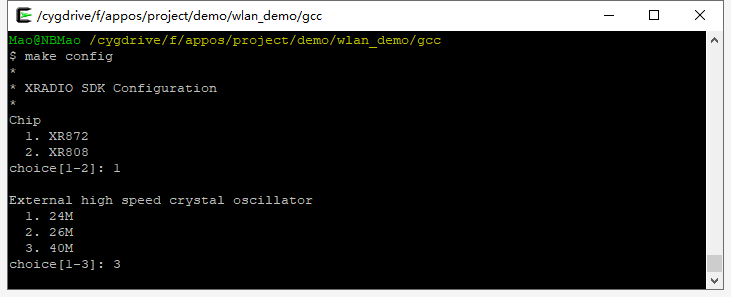
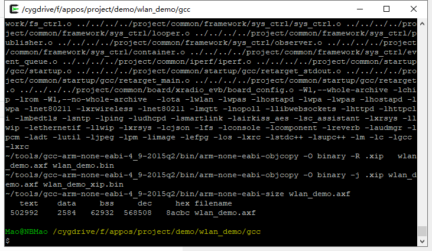
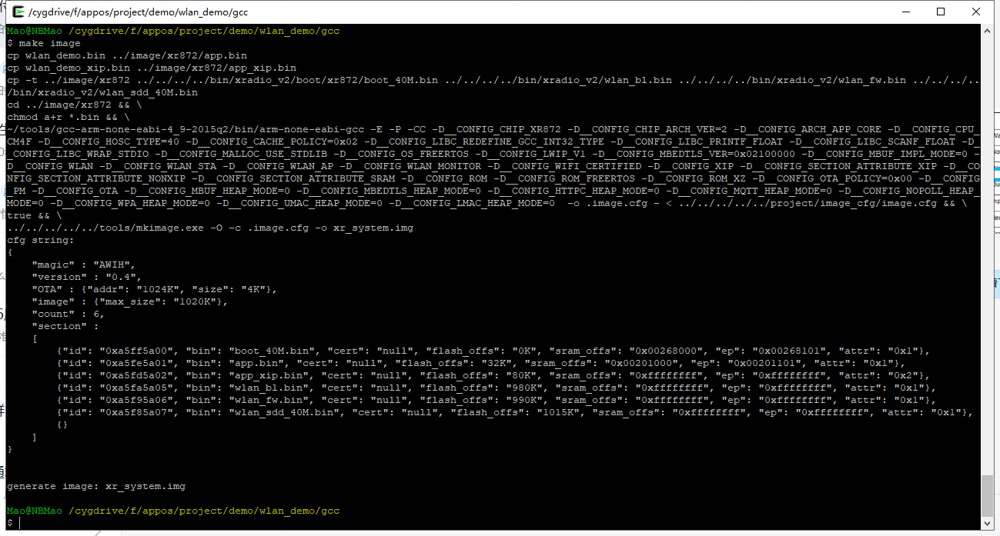
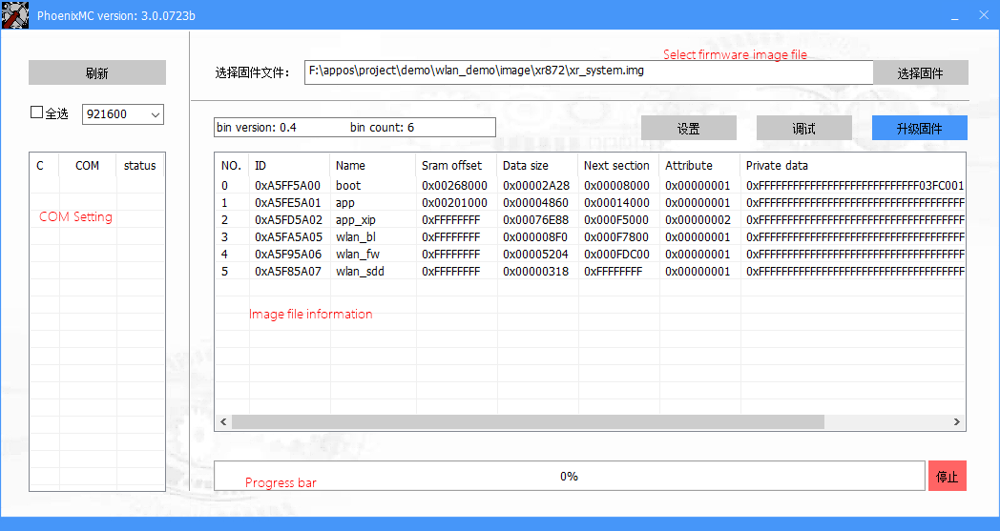
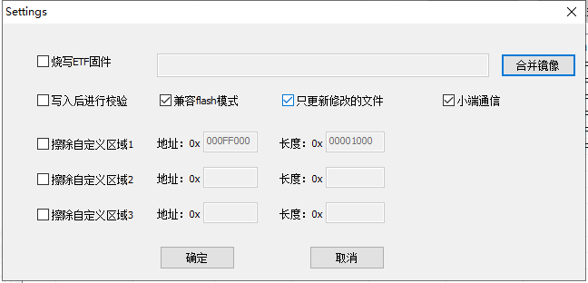

[[English]](index-en.md)

<style>
table { width: 100%; }
table th {
    font-weight: bold; /*加粗*/
    text-align: left !important; /*内容居中，加上 !important 避免被 Markdown 样式覆盖*/
    background: rgba(158,188,226,0.5); /*背景色*/
    color: white;
}
table tbody tr:nth-child(2n) {
    background: rgba(158,188,226,0.12); 
}
table th {
    white-space: nowrap; /*表头内容强制在一行显示*/
}
</style>

# 概述

此文档旨在指导芯之联无线MCU产品开发者从零开始搭建开发所必须的软硬件开发环境，为开发工作做好准备，并指导其在某一指定平台完成SDK下载，工具安装，工程创建，编译，打包，烧录等一系列流程步骤。

| 注意|
|:---- |
|该文档中提到的一系列步骤具有普适性，适用于XR808，XR872等各无线MCU SDK平台，示例为了方便选取其一，其他平台需要根据其硬件及软件定义灵活处理|

# 准备工作
* 硬件
    * 一块开发板
    * 一根USB转UART线 (建议采用CH340芯片平台)
    * PC (Windows，Linux或MacOS)

* 软件
    * 工具链及编译工具(gcc, make等)
    * git工具
    * 代码编辑器(VSCode，Ultraedit，Vim等)

连接示意图如下：  


# 了解硬件
请点击下方链接，了解有关具体开发板的详细信息。

* [XR872_EVB_IO](xr872_evb_io.md)
* [XR872_EVB_AI](xr872_evb_AI.md)
* [XR808_EVB_IO](xr808_evb_io.md)

# 搭建环境
## Linux平台搭建
以Ubuntu为代表系统说明如下：

##### 1. 打开终端窗口，安装开发相关工具，在终端窗口输入以下命令

```bash
sudo apt-get install cmake git python python-pip vim wget
```

##### 2. 创建工作目录并下载SDK

```bash
mkdir xradiotech
cd xradiotech
git clone https://github.com/XradioTech/xradio-skylark-sdk.git
```
此时芯之联无线MCU SDK将会下载到xradiotech的目录下，仓库名为xradio-skylark-sdk

##### 3. 创建工具目录，并下载gcc工具

```bash
cd xradiotech  
mkdir tools  
cd tools  
wget https://launchpad.net/gcc-arm-embedded/4.9/4.9-2015-q2-update/+download/gcc-arm-none-eabi-4_9-2015q2-20150609-linux.tar.bz2  
tar -xf gcc-arm-none-eabi-4_9-2015q2-20150609-linux.tar.bz2
```

## Windows平台搭建
##### 1. 安装Cygwin工具

* 从Cygwin官方网站下载Cygwin终端setup-x86.exe
*  运行setup-x86.exe安装Cygwin工具包（**注意：安装路径不要包含中文路径或者空格**）
* 在安装包选项选择想要安装的工具包（**cmake, git, wget, binutils， python, python-pip， zip, unzip, vim**等）

##### 2. 运行Cygwin Terminal进入到终端程序，进入到工程目录（自己选择），创建工程目录，并下载SDK

```bash
mkdir xradiotech
cd xradiotech
git clone https://github.com/XradioTech/xradio-skylark-sdk.git
```

此时芯之联无线MCU SDK将会下载到xradiotech的目录下，仓库名为xradio-skylark-sdk

##### 3. 创建工具目录，并下载gcc工具

```bash
cd xradiotech
mkdir tools
cd tools
wget https://launchpad.net/gcc-arm-embedded/4.9/4.9-2015-q2-update/+download/gcc-arm-none-eabi-4_9-2015q2-20150609-win32.zip
unzip -o gcc-arm-none-eabi-4_9-2015q2-20150609-win32.zip
```

| 注意|
|----|
|如果wget和unzip命令执行失败，请点击上面的链接直接通过浏览器下载到tools目录使用相关的工具解压|

## 编译示例工程
##### 1. 配置gcc路径
修改 `xradio-skylark-sdk/gcc.mk` 中的“CC_DIR”变量，将路径指向解压缩的 
`gcc-arm-none-eabi-xxxxx/bin`目录：

```bash
CC_DIR = ~/tools/gcc-arm-none-eabi-4_9-2015q2/bin
```

##### 2. 选择工程 `project/demo/wlan_demo` , 进入gcc目录，配置工程型号及时钟类型

```
make config
```

配置界面示例如下：  


##### 3. 编译系统模块生成模块 .a 文件， 并生成可执行文件

```
make lib -j4
make
```

正确编译完成后，结果显示如下：  


##### 4. 打包固件，生成镜像文件

```
make image
```

正确打包完成后，结果显示如下：  


附：

|命令|行为|
| ---- | ---- |
|make config | 配置工程平台芯片型号及板级晶振选型，目前主要包括XR872和XR808平台，配置完成后将在xradio-skylark-sdk目录下生成.config文件<br>*注:在编译之前必须执行，否则无法编译* |
|make config_clean | 清除.config文件 |
|make lib | 编译功能模块，生成.a文件并拷贝到lib目录下 |
|make lib_clean | 清理已编译的lib目标文件，及模块的.o文件，但并不会删除lib下的.a文件|
|make lib_install_clean | 清理lib下的.a文件 |
|make | 编译工程代码，生成可执行文件（位于“project/[prj]/gcc/”目录）|
|make clean | 清除make命令生成的目标文件 |
|make image | 创建镜像文件（位于“project/image/xxx/”目录）|
|make build | 等同于make lib && make && make image |
|make build_clean | 等同于make image_clean clean lib_clean lib_install_clean |
|make objdump | 生成反汇编文件，用于代码分析和调试 |
|make size | 显示工程ELF文件的size信息，如text段、data段、bss段大小等 |

## 烧录固件
##### 1. 烧录工具
烧录固件使用`xradio-skylark-sdk/tools/PhoenixMC.exe`工具，界面如下



* 串口设置 - 点击“刷新”按钮可以显示COM口列表，勾选选择COM口，下拉选择波特率，默认115200
* 选择固件 - 点击按钮选择应用程序固件文件，默认为xr_system.img文件
* 升级固件 - 当设备连接并接入升级模式，选择完固件并设置好COM口后，点击“升级固件”按钮开始升级
* 镜像信息 - 显示镜像的打包信息，具体含义可参考打包配置文件说明
* 进度条   - 刷机过程中可显示刷机进度，当完成100%时完成刷机
* 设置 - 设置刷机默认条件
* 调试 - 调试工具，可以在升级模式下读写flash，读写寄存器状态等信息

##### 2. 设置界面



* 烧写ETF | 合并镜像 - 将xr_system.img和etf.img合并成一个固件，同时烧写进去。*注：etf固件为RF测试固件*
* 写入后进行校验 - 烧录通过读出内容校验写入的正确性，不勾选时仅靠通信协议保障正确性。*注：会影响烧录速度*
* 兼容flash模式 - 默认勾选，兼容XR871，XR809平台模式
* 只更新修改的文件 - 烧录前确认数据是否修改，如无修改则调过此段，用以节省时间
* 小端通信 - 传输协议采用小端数据格式
* 擦除自定义区域 - 烧录完成后擦除指定的flash区域，需小心使用

##### 3. 烧录

  1. 进入升级模式
  2. 选择固件和串口，点击升级
  3. 等待完成

附：进入升级模式的方法

|场景|进入升级模式方法|适用平台|
| ---- | ---- | ---- |
|裸片(flash为空片)|上电后将自动进入升级模式|所有平台|
|正在运行的系统|方法1：控制台输入“upgrade”+回车，系统会重启并进入升级模式<br>方法2：断开控制台，设置好PhoenixMC，直接选择“升级固件”，工具会发送方法1中的命令使设备进入升级模式|所有平台|
|任何场景强制升级|步骤：<br>1. 拉低CHIP-PWD复位芯片<br>2. 拉低PB2,PB3到低电平<br>3. 松开CHIP-PWD使芯片运行，然后释放PB2,PB3<br>此时芯片强制进入升级模式|所有平台|

##### 4. Linux平台烧录
烧录固件使用`xradio-skylark-sdk/tools/phoenixMC`命令行工具进行烧写，工具配置见setting.ini文件

## 调试使用
*注：XRADIOTECH的MCU平台仅支持串口打印信息辅助调试，暂不支持Keil，IAR等IDE集成开发环境*

启动后打印信息查看系统运行状况，并通过控制台命令来辅助才做相关行为，控制台命令请参考[<控制台命令集成与命令集参考>]()

## 目录结构及工程配置

## 创建新工程

## 配置新工程

## 工程小技巧

## 参考文档
