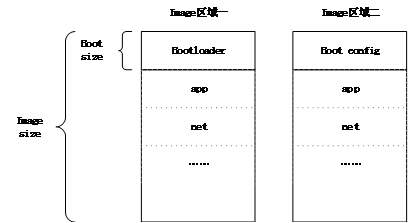

[[English]](wifi-dev-en.md)

---
# 目录

  - [FOTA 简介](#FOTA简介)
  - [BOOT 配置](#BOOT配置说明)
  - [API说明](#API说明)
  - [使用示例](#使用示例)
  - [私有协议扩展](#私有协议扩展)
  
-----
# FOTA简介
FOTA(Firmware Over The Air,空中固件升级,以下简称OTA)是从远程服务器上下载软件到本地，由本地完成软件版本的升级。SDK中的OTA方案通过对两个Image区域进行乒乓操作实现对固件的升级，两个Image区域如下图所示：

  

详细信息如下：

* Flash空间由两个区域组成，此处成为"区域一"和"区域二"，且两个区域大小相同，为Image_size
* 区域一由Bootloader和应用固件app_fw组成，区域二由boot_config及启动备份区组成
* bootloader与boot_config区域大小相同，同为Boot Size，在`image.cfg`的"OTA"选项中的size字段定义
* Image_size在在`image.cfg`的"image"选项中的max_size字段定义
* OTA升级时，固件区内容及bootloader保持不变，OTA升级任务将新的固件下载到备份区，并更新boot_config标志，固件区和备份区角色调换
* OTA完成后，系统重启时根据boot_config相关标志判断选择从新的固件区启动，原固件区作为备份区用于下一次升级
* 当OTA失败时，boot_config则不会更新，下次启动时仍然选择原有固件区内容启动，防止异常发生

# BOOT配置说明

系统启动时，从boot_config区读取信息的值需要加载哪个区域的固件。Boot config中主要存储结构体类型`ota_cfg_t`的数据，结构体类型定义在`xradio-skylark-sdk/include/image/image.h`中定义如下：

```C
    typedef enum ota_image {
    	OTA_IMAGE_1ST = 1,
    	OTA_IMAGE_2ND = 2,
    } ota_image_t;

    typedef enum ota_state {
    	OTA_STATE_UNVERIFIED	= 0,
    	OTA_STATE_VERIFIED		= 1,
    } ota_state_t;

    typedef struct ota_cfg {
    	ota_image_t	image;
    	ota_state_t	state;
    } ota_cfg_t;
```
 
  * ota_image_t - Image区域的序号，OTA_IMAGE_1ST表示区域一，OTA_IMAGE_2ND表示区域二
  * ota_state_t - 是固件校验状态，OTA_STATE_UNVERIFIED表示固件校验失败，OTA_STATE_VERIFIED表示固件校验成功。

ota_image_t 与 ota_state_t组合值所对应的逻辑关系如下：

|||ota_image_t|ota_image_t|
| :----: | :----: | :----: | :----: |
|   -  |   -  | 1 | 2 |
|ota_state_t|0|启动：区域二<br>升级：区域一|启动：区域一<br>升级：区域二|
|ota_state_t|1|启动：区域一<br>升级：区域二|启动：区域二<br>升级：区域一|


# API说明

OTA操作接口定义在`include/ota/ota.h`中，下面对OTA模块提供的接口进行简要说明：

* 初始化OTA模块


```C
    ota_status_t ota_init(void);
```

OTA初始化过程中会通过Image模块提供的接口image_get_ota_param()从Flash中的boot_config区域中获得image参数信息，并存储在私有变量中。

image_ota_param_t定义如下：

```C
typedef struct image_ota_param {
	uint32_t	ota_flash : 8;	/* flash ID of OTA area */
	uint32_t	ota_size  : 24; /* size of OTA area */
	uint32_t	ota_addr;		/* start addr of OTA area */
	uint16_t	img_max_size; 	/* image max size (excluding bootloader, the unit is K) */
	uint16_t	img_xz_max_size;/* compressed image max size (the unit is K)*/
	uint32_t	bl_size;		/* bootloader size */
	image_seq_t running_seq;	/* running image sequence */
	uint8_t		flash[IMAGE_SEQ_NUM];	/* flash ID which the image on */
	uint32_t	addr[IMAGE_SEQ_NUM];	/* image start addr, excluding bootloader */
} image_ota_param_t;
```

与`ota_init()`操作相反的操作是反初始化函数，其会清除保存在内存中的参数信息，其定义如下

```C
    void ota_deinit(void);
```

* 获取OTA数据

    OTA模块支持两种方式升级固件：
    * 从网络通过HTTP协议升级系统
    * 从SD卡通过读取文件升级系统

    其造作如下：

```C
ota_status_t ota_get_image(ota_protocol_t protocol, void *url);
```

升级方式传参ota_protocol_t定义在`xradio-skylark-sdk/include/image/image.h`，如下：

```C
    typedef enum ota_protocol {
    	OTA_PROTOCOL_FILE	= 0,
    	OTA_PROTOCOL_HTTP	= 1,
    } ota_protocol_t;
```

* OTA数据验证

当OTA数据获取完成后，OTA模块可通过多种方式对OTA数据进行校验，从而保证传输的正确性，其操作如下：

```C
ota_status_t ota_verify_image(ota_verify_t verify, uint32_t *value);
```

数据校验方式需要设备端与服务器端协商一致，此处提供多种校验方式，定义如下：

```C
typedef enum ota_verify {
    OTA_VERIFY_NONE		= 0,
    OTA_VERIFY_CRC32	= 1,
    OTA_VERIFY_MD5		= 2,
    OTA_VERIFY_SHA1		= 3,
    OTA_VERIFY_SHA256	= 4,
} ota_verify_t;
```

* OTA重启系统

当OTA数据更新完成并校验通过后，可通过`ota_reboot()`来重启系统，从而让新系统生效。

```C
    void ota_reboot(void);
```

# 使用是咧


```C
uint32_t *verify_value;
ota_verify_t verify_type;
ota_verify_data_t verify_data;
char url[] = "http://192.168.1.100/OTA/xr_system.img";

ota_init();

if (ota_get_image(OTA_PROTOCOL_HTTP, url) != OTA_STATUS_OK) {
    printf("OTA http get image failed\n");
    return CMD_STATUS_ACKED;
}

if (ota_get_verify_data(&verify_data) != OTA_STATUS_OK) {
    verify_type = OTA_VERIFY_NONE;
    verify_value = NULL;
} else {
    verify_type = verify_data.ov_type;
    verify_value = (uint32_t*)(verify_data.ov_data);
}

if (ota_verify_image(verify_type, verify_value)  != OTA_STATUS_OK) {
    CMD_ERR("OTA http verify image failed\n");
    return -1;
}

ota_reboot();

return 0;
```

# 私有协议扩展

OTA模块已提供Http和本地文件系统两种途径获取固件，如您采用其他协议获取数据，则需要在系统中对此方式进行扩展，具体步骤如下：

##### 1. 在文件ota.h中将扩展的协议类型补充到数据类型ota_protocol_t。

```C
typedef enum ota_protocol {
    OTA_PROTOCOL_FILE	= 0,
    OTA_PROTOCOL_HTTP	= 1,
    OTA_PROTOCOL_XXXX	= 2,
} ota_protocol_t;
```

##### 2. 实现扩展协议下载固件的两个回调函数，回调函数类型在文件`include/ota/ota_i.h`中定义如下。可参考Http协议和File协议对两个回调函数的实现（ota_http.h、ota_http.c、ota_file.h、ota_file.c）。

```C
    typedef ota_status_t (*ota_update_init_t)(void *url);
    typedef ota_status_t (*ota_update_get_t)(uint8_t *buf, uint32_t buf_size,
    										uint32_t *recv_size, uint8_t *eof_flag);
```

##### 3. 将扩展协议的两个回调函数注册到文件ota.c的函数ota_get_image()中。

```
    case OTA_PROTOCOL_FILE:
    	return ota_update_image(url, ota_update_file_init, ota_update_file_get);
    case OTA_PROTOCOL_HTTP:
    	return ota_update_image(url, ota_update_http_init, ota_update_http_get);
    case OTA_PROTOCOL_XXXX:
    	return ota_update_image(url, ota_update_xxxx_init, ota_update_xxxx_get);
```