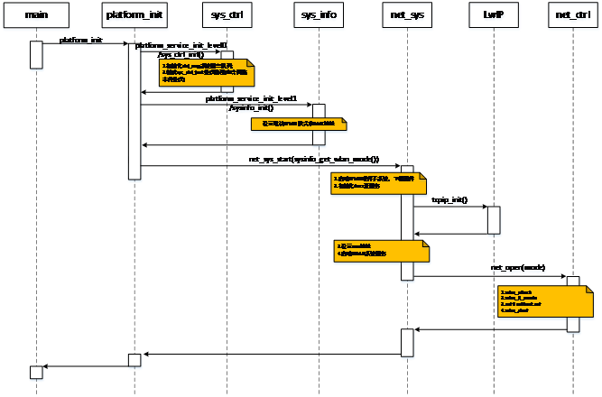

[[English]](wifi-dev-en.md)

---

# 目录
  - [WLAN 系统启动流程](#WLAN系统启动流程)
  - [Station 模式](#Station模式)
  - [HostAP 模式](#HostAP模式)
  - [Monitor 模式](#Monitor模式)
  - [监听网络事件](#监听网络事件)
  - [参考文档](#参考文档)
  - [参考示例工程](#参考示例工程)

----

# WLAN系统启动流程
在wlan_demo工程中，网络系统加载流程如下：



网络系统加载过程中依次完成了以下几个重要的过程：

1. 初始化系统消息队列，创建系统消息处理线程；
2. 配置网络子系统硬件，加载网络子系统固件；
3. 初始化DUCC服务，注册回调函数(仅XR871)；
4. 初始化TCP/IP协议栈；
5. 创建netif网络接口并启动WLAN子系统任务；

----

# Station模式

* 默认启动Station模式
  
  Note: in `project/common/framework/platform_init.c`  调用流出如下:  
  platform_init()  
  ----->platform_init_level1()  
  ---------->net_sys_init() + net_sys_start(sysinfo->wlan_mode);

```C
#include "net/wlan/wlan.h"  
#include "net/wlan/wlan_defs.h"  
#include "common/framework/net_ctrl.h"

net_sys_init();               // prepare the lwip
net_sys_start(WLAN_MODE_STA); // start the wlan system
```

* 加入工作在开放模式的AP

```C
// ssid of the AP: TEST_AP
// psk of the AP: no psk
uint8_t ssid[] = "TEST_AP";
uint8_t ssid_len = strlen((char *)ssid);

wlan_sta_set(ssid, ssid_len, NULL);
wlan_sta_enable();
```

* 加入工作在WPA/WPA2模式的AP

```C
// ssid of the AP: TEST_AP
// psk of the AP: 12345678
uint8_t ssid[] = "TEST_AP";
uint8_t ssid_len = strlen((char *)ssid);
uint8_t psk[] = "12345678";

wlan_sta_set(ssid, ssid_len, psk);
wlan_sta_enable();
```

* 加入工作在WEP模式的AP

```C
// ssid of the AP: TEST_AP
// the key0 of the AP: 1234567890
uint8_t ssid[] = "TEST_AP";
uint8_t ssid_len = strlen((char *)ssid);
uint8_t psk[] = "1234567890";

wlan_sta_config_t config = {0};

/* ssid */
config.field = WLAN_STA_FIELD_SSID;
memcpy(config.u.ssid.ssid, ssid, ssid_len);
config.u.ssid.ssid_len = ssid_len;
if (wlan_sta_set_config(&config) != 0)
    return -1;

/* WEP key0 */
config.field = WLAN_STA_FIELD_WEP_KEY0;
strlcpy((char *)config.u.wep_key, psk, sizeof(config.u.wep_key));
if (wlan_sta_set_config(&config) != 0)
    return -1;

/* WEP key index */
config.field = WLAN_STA_FIELD_WEP_KEY_INDEX;
config.u.wep_tx_keyidx = 0;
if (wlan_sta_set_config(&config) != 0)
    return -1;

/* auth_alg: SHARED */
config.field = WLAN_STA_FIELD_AUTH_ALG;
config.u.auth_alg = WPA_AUTH_ALG_SHARED;
if (wlan_sta_set_config(&config) != 0)
    return -1;

/* key_mgmt: NONE */
config.field = WLAN_STA_FIELD_KEY_MGMT;
config.u.key_mgmt = WPA_KEY_MGMT_NONE;
if (wlan_sta_set_config(&config) != 0)
    return -1;

if (wlan_sta_enable()!= 0)
    return -1;
```

* 获取当前的配置参数
    * set the configure field
    * get the configuration of this field
    * fields defined in `wlan_def.h` as follows:
  
```C
typedef enum wlan_sta_field {
    WLAN_STA_FIELD_SSID = 0,
    WLAN_STA_FIELD_PSK,
    WLAN_STA_FIELD_WEP_KEY0,
    WLAN_STA_FIELD_WEP_KEY1,
    WLAN_STA_FIELD_WEP_KEY2,
    WLAN_STA_FIELD_WEP_KEY3,
    WLAN_STA_FIELD_WEP_KEY_INDEX,
    WLAN_STA_FIELD_KEY_MGMT,
    WLAN_STA_FIELD_PAIRWISE_CIPHER,
    WLAN_STA_FIELD_GROUP_CIPHER,
    WLAN_STA_FIELD_PROTO,
    WLAN_STA_FIELD_AUTH_ALG,
    WLAN_STA_FIELD_WPA_PTK_REKEY,
    WLAN_STA_FIELD_SCAN_SSID,
    WLAN_STA_FIELD_NUM,
} wlan_sta_field_t;
```

示例代码如下:

```C
wlan_sta_config_t config = {0};

config.field = WLAN_STA_FIELD_PSK;
if (wlan_sta_get_config(&config) != 0)
    return -1;

printf("psk: %s\n", config.u.psk);
```

* 扫描
    * 扫描出的AP节点结构信息如下

```C 
typedef struct wlan_sta_ap {
    wlan_ssid_t	ssid;
    uint8_t		bssid[6];
    uint8_t		channel;
    uint16_t	beacon_int;
    int		freq;
    int		rssi;
    int		level;
    int		wpa_flags;
    int		wpa_cipher;
    int		wpa_key_mgmt;
    int		wpa2_cipher;
    int		wpa2_key_mgmt;
} wlan_sta_ap_t;
```

* 执行一次扫描

```C
wlan_sta_scan_once();

// do some delay here, 5s, 10s
wlan_sta_scan_results_t results;
results.size = 10;
results.ap = malloc(results.size * sizeof(wlan_sta_ap_t));
if (results.ap == NULL) {
    ……
}
if (wlan_sta_scan_result(&results) == 0) {
    ……
}
free(results.ap);
```

* 连接或断开AP

```C
wlan_sta_disconnect();
wlan_sta_connect();
```

*  获取当前连接状态
    *  wlan_sta_states_t

```C
typedef enum wlan_sta_states {
    WLAN_STA_STATE_DISCONNECTED = 0,
    WLAN_STA_STATE_CONNECTED = 1,
} wlan_sta_states_t;
```

  示例代码如下:

```C
wlan_sta_states_t state;
wlan_sta_state(&state);
```

*  获取已连接的AP的信息

```C
wlan_sta_ap_t ap_info = {0};
wlan_sta_ap_info(&ap_info);
```

----

# HostAP模式
* 启动WLAN系统并工作在AP模式

```C
#include "net/wlan/wlan.h"  
#include "net/wlan/wlan_defs.h"  
#include "common/framework/net_ctrl.h"

net_sys_init();                  // prepare the lwip
net_sys_start(WLAN_MODE_HOSTAP); // start the wlan system
```

* 开放模式

```C
uint8_t ssid[] = "TEST_AP";
uint8_t ssid_len = strlen((char *)ssid);

wlan_ap_set(ssid, ssid_len, NULL);
wlan_ap_disable();
wlan_ap_enable();
```

* 加密模式

```C
uint8_t ssid[] = "TEST_AP";
uint8_t ssid_len = strlen((char *)ssid);
uint8_t psk[] = "12345678";

wlan_ap_set(ssid, ssid_len, psk);
wlan_ap_disable();
wlan_ap_enable();
```

* 设置/获取工作参数
    * Set the work channel
    * Get the work channel

```C
wlan_ap_config_t config = {0};
config.field = WLAN_AP_FIELD_CHANNEL;
config.u.channel = 6;
wlan_ap_set_config(&config);
```

```C
wlan_ap_config_t config = {0};
config.field = WLAN_AP_FIELD_CHANNEL;
wlan_ap_get_config(&config);
```

* 获取连接的station的数量

```C
int num;
wlan_ap_sta_num(&num);
```

```C
wlan_ap_stas_t stas;
stas.size = 5;			//最多获取5个已连接Station信息
stas.sta = malloc(stas.size * sizeof(wlan_ap_sta_t));
if (stas.sta == NULL) {
    ……
}

if (wlan_ap_sta_info(&stas) == 0) {
    ……				//处理获取的Station信息，实际获取Station个数为stas.num
}
free(stas.sta);
```

----

# Monitor模式
* 注册数据接收回调

```C
#include "smartlink/sc_assistant.h"

int sc_assistant_monitor_register_rx_cb(struct netif *nif, wlan_monitor_rx_cb cb);
```

callback接口原型定义如下:

```C
void monitor_data_callback(uint8_t *data, uint32_t len, void *info);
```

* 启动监听模式

```C
#include "net/wlan/wlan.h"  
#include "net/wlan/wlan_defs.h"  
#include "common/framework/net_ctrl.h"

net_sys_init();                  // prepare the lwip
net_sys_start(WLAN_MODE_MONITOR); // start the wlan system
```

wlan子系统已经就位的情况下可调用net_mode_switch()来切换到monitor模式

```C
net_switch_mode(WLAN_MODE_MONITOR);
```

----

# 监听网络事件
参考以下demo

```C
#include "common/framework/sys_ctrl/sys_ctrl.h"
#include "common/framework/net_ctrl.h"

void net_event_callback(uint32_t event, uint32_t data)
{
	uint16_t type = EVENT_SUBTYPE(event);

	printf("%s msg (%u, %u)\n", __func__, type, data);
	switch (type) {
	case NET_CTRL_MSG_WLAN_CONNECTED:
		printf("NET_CTRL_MSG_WLAN_CONNECTED\n");
		
		break;
	case NET_CTRL_MSG_WLAN_SCAN_SUCCESS:
		printf("NET_CTRL_MSG_WLAN_SCAN_SUCCESS\n");
		
		break;
	case NET_CTRL_MSG_WLAN_CONNECT_FAILED:
		printf("NET_CTRL_MSG_WLAN_CONNECT_FAILED\n");
	
		break;
	case NET_CTRL_MSG_NETWORK_UP:
		printf("NET_CTRL_MSG_NETWORK_UP\n");
	
		break;
	case NET_CTRL_MSG_NETWORK_DOWN:
		printf("NET_CTRL_MSG_NETWORK_DOWN\n");
	
		break;
	case NET_CTRL_MSG_WLAN_DISCONNECTED:
	case NET_CTRL_MSG_WLAN_SCAN_FAILED:
	case NET_CTRL_MSG_WLAN_4WAY_HANDSHAKE_FAILED:
		printf("do nothing msg (%u, %u)\n", type, data);
		break;
	default:
		printf("unknown msg (%u, %u)\n", type, data);
		break;
	}
}

int net_service_init(void)
{
	observer_base *observer;

	printf("foneric_net_service_init, register network observer\n");
	observer = sys_callback_observer_create(CTRL_MSG_TYPE_NETWORK,
						NET_CTRL_MSG_ALL,
						net_event_callback);
	if (observer == NULL)
		return -1;
	if (sys_ctrl_attach(observer) != 0)
		return -1;

	return 0;
}
```

## 参考文档
* [XR871_WiFi_Developer_Guide-CN.pdf](./doc/XR871/sdkdoc/XR871_WiFi_Developer_Guide-CN.pdf)

# 参考工程示例及文件

* xradio-skylark-sdk/project/demo/wlan_demo
* xradio-skylark-sdk/include/net/wlan/wlan.h